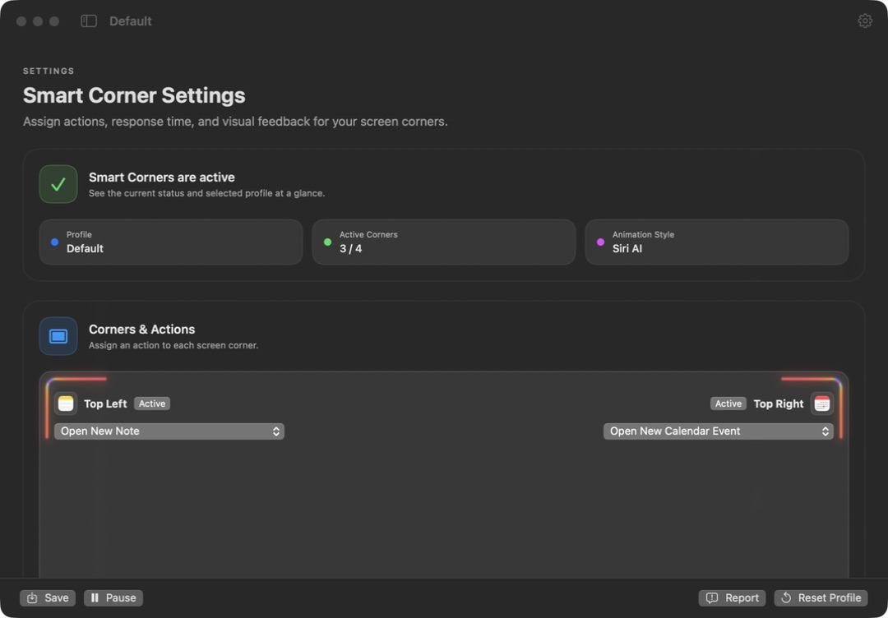
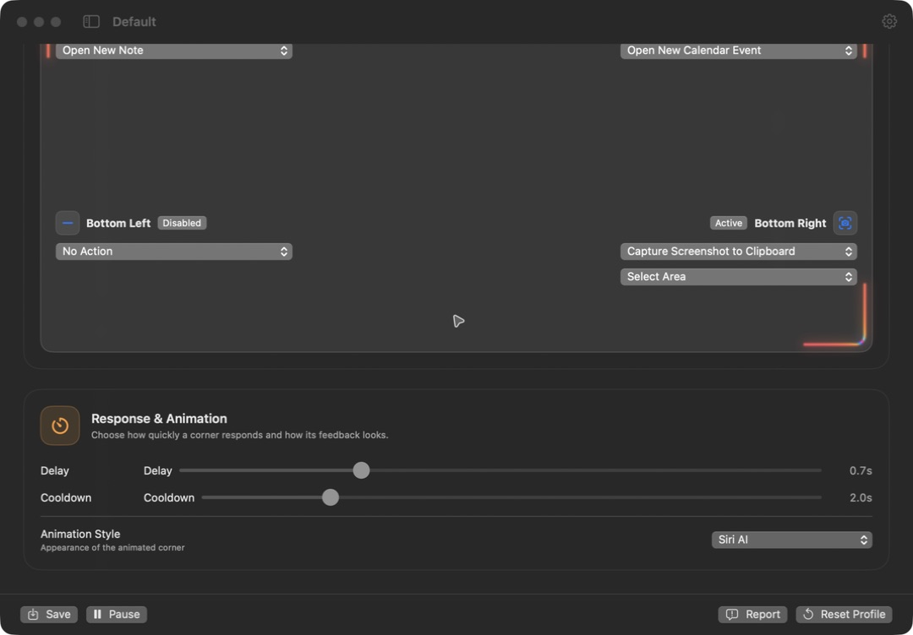

# SmartCorners

A free macOS menu bar app that turns screen corners into shortcuts. Move your pointer into a corner, wait for the configured delay, and run its assigned action.

**Version 0.1.1 · Build 17**

Apple Silicon (M1 or later) · macOS 13 or later · English interface

[Download SmartCorners](https://github.com/Marcobrmn/SmartCorners-Releases/releases/tag/v0.1.1) · [Release notes](RELEASE_NOTES.md) · [Report a problem](https://github.com/Marcobrmn/SmartCorners-Releases/issues)

## Features

- Assign an action to each of the four screen corners.
- Create profiles and switch between them.
- Adjust activation delay and cooldown.
- Choose a corner animation style, or disable individual corners.
- Pause and resume from the menu bar.
- Optionally start SmartCorners when you log in.

### Available actions

| Action | What it does |
| --- | --- |
| Open Website | Opens the address you enter in its registered app. |
| Open Application | Opens an installed application. |
| Run Shortcut | Runs a shortcut you have created in macOS Shortcuts. |
| Capture Screenshot to Clipboard | Captures the full screen, a selected window or a selected area. Paste the result into another app. |
| Open New Calendar Event | Opens Calendar and starts a new event for you to fill in. |
| Open New Note | Opens Notes and starts a blank note. |
| No Action | Leaves the corner unused. |

Focus mode is not available yet. Calendar and Notes actions do not insert a predefined title or text. “Siri AI” is an animation style, not a Siri or AI integration.

## Screenshots





## Installation

### Distribution and trust

SmartCorners is **not signed with an Apple Developer ID and is not notarized**. macOS may block the first launch. Only open it if you trust the download source.

1. Download the DMG from [Releases](https://github.com/Marcobrmn/SmartCorners-Releases/releases/tag/v0.1.1).
2. Quit any older copy of SmartCorners.
3. Open the DMG in Finder and drag **SmartCorners.app** into **Applications**.
4. Eject the DMG and open SmartCorners from Applications.
5. If macOS blocks it, open **System Settings → Privacy & Security → Open Anyway** for SmartCorners, if offered, and confirm the prompt. See [Apple’s instructions](https://support.apple.com/en-us/102445).

Use Finder to copy the app from the official DMG. Other extraction tools may omit metadata needed by its action helper. Keep macOS security protections enabled.

### Verify the download (optional)

Compare the checksum with [SHA256SUMS.txt](SHA256SUMS.txt):

```sh
shasum -a 256 ~/Downloads/SmartCorners-0.1.1-build.17-github-non-notarized-b2114aaf131b.dmg
```

Expected SHA-256:

```text
413a1a40f07e40a94adae61ed63d0964001657b6ac4663b7249d5095d1a8ecf1
```

## Getting started

1. Complete the welcome screen.
2. For screenshot, Calendar and Notes actions, grant **SmartCorners Actions** access in **System Settings → Privacy & Security → Accessibility**. An existing grant for the main SmartCorners app does not apply to this helper.
3. Review existing Apple Hot Corners. The optional **Disable Apple Hot Corners** button clears all four macOS corner assignments and restarts the Dock. It does not restore your previous assignments later.
4. Open **Settings** from the menu bar and select a profile.
5. Choose an action for each corner and enable the corners you want to use.
6. Adjust **Delay**, **Cooldown** and **Animation Style**.
7. Hold your pointer in a corner for the selected delay. Move away and back to trigger it again.

Use **+** to create a profile, edit **Name** to rename it, and **−** to delete it. The last profile cannot be deleted. **Reset Profile** resets only the selected profile.

Most settings save immediately; **Save** also stores the current configuration. **Pause** stays in effect until you choose **Enable**, including after restarting the app. Closing Settings leaves SmartCorners running in the menu bar. Choose **Quit** to exit.

General settings contain **Launch at Login**, update preferences, permission checks and **Show Welcome Again**.

## Updates

Version 0.1.1 is available as a manual download. The update feed currently has no published updates. To install it, quit SmartCorners and replace the app in Applications with the copy from the new DMG.

**Check for Updates…** is available in the menu bar and general settings. Checking closes the Settings window; SmartCorners continues running in the menu bar.

## Privacy and permissions

Profiles stay on your Mac. SmartCorners has no app accounts, analytics or telemetry uploads. Update checks connect to GitHub; websites, apps and Shortcuts you launch may use their own network services.

The **SmartCorners Actions** helper needs Accessibility access to send keyboard commands for screenshots, Calendar and Notes. Shortcuts may request additional permissions of their own. Screenshots go to your clipboard, not to a SmartCorners server.

See [Privacy](PRIVACY.md) for local files, network access and removal instructions.

## Troubleshooting

- **A corner does nothing:** check that monitoring and the corner are enabled, select the correct profile and wait for the configured delay. Review any conflicting Apple Hot Corners.
- **Screenshot, Calendar or Notes actions fail:** check Accessibility access for **SmartCorners Actions**, choose **Refresh Status**, then quit and reopen SmartCorners if needed. If authorization is missing, reinstall using Finder and the official DMG.
- **An app or Shortcut is missing:** install the app or create the Shortcut first, then reopen Settings.
- **A configuration warning appears:** monitoring stops to protect your saved settings. Review the recovery options before choosing defaults; the unreadable file is preserved.
- **No update is offered:** download version 0.1.1 manually from Releases.
- **Uninstall:** disable **Launch at Login**, quit SmartCorners and move it to the Trash. To remove saved profiles and review permissions, follow [Removing local data](PRIVACY.md#removing-local-data).

## Support

Use [Issues](https://github.com/Marcobrmn/SmartCorners-Releases/issues) or **Report → Open on GitHub** in the app. Include the SmartCorners version, macOS version, reproduction steps and expected behavior. The app opens a draft; you review and submit it yourself. **Copy Report** copies the text for manual pasting.

Do not include personal data in public reports. For security problems, follow [SECURITY.md](SECURITY.md).

## License and source

SmartCorners is a free binary download; its source code is not publicly available. See [Source availability](SOURCE_AVAILABILITY.md) and [Sparkle’s license](THIRD_PARTY_NOTICES/Sparkle-LICENSE.txt).
